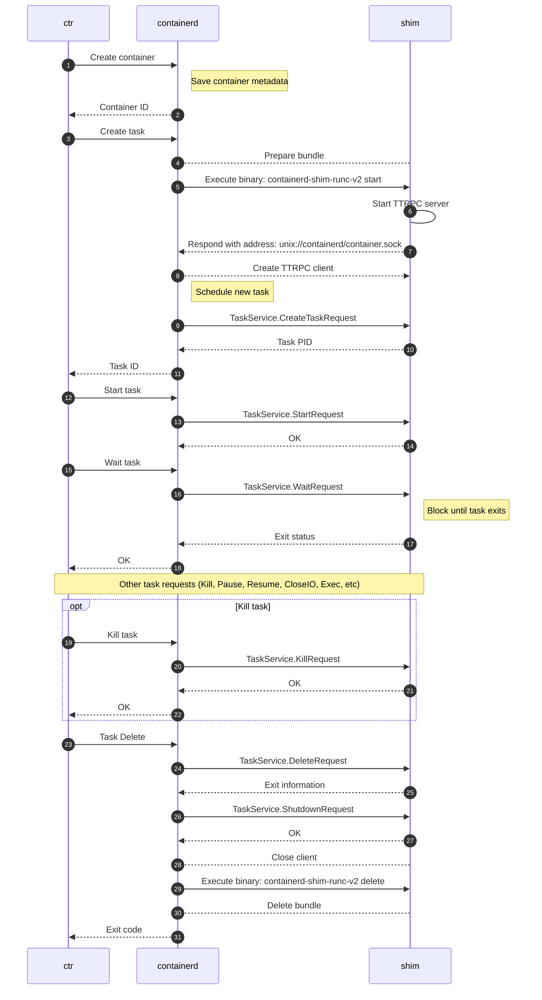

1. 컨테이너
- 올인원 패키징
- 자원 보장
- 격리

1-1. 올인원 패키징
- 일관성 보장 : 컨테이너 이미지를 통해 애플리케이션 실행을 위해 필요한 종속성을 정의하여, 실행에 있어서 항상 동일한 환경을 보장한다.
  - 운영 체제 (ex. FROM ubuntu)
  - 애플리케이션 종속성(ex. python's requirements.txt)
  - 애플리케이션
- 중복 제거 : 수 많은 이미지에서 사용되는 layer를 모두 개별 파일 시스템으로 저장할까?
  - overlay file system & overlay mount
  - overlay fs(union fs)란 여러개의 디렉토리를 합쳐 마치 하나의 가상 파일 시스템처럼 보이게한다. 
    - lower layer : n개의 레이어로 구성된 readonly 영역.
      - base image뿐만 아니라 ls, which 등 명령어도 모두 디렉토리로 구성되어 있고 이러한 layer를 쌓아 lower layer를 만든다.
      - 그러니 도커허브등은 재사용되는 파일시스템을 매 번 개별 저장할 필요가 없다.
      - 참고로 도커에서 FROM,COPY,CMD,RUN.. 모두 새로운 layer를 이전 layer에 쌓아 만든다.
    - upper layer : writable영역으로 각 컨테이너마다 개별 존재.
    - merge view : lower + upper의 결과물로 실제 컨테이너에서 보여지는 영역
  - CoW(copy on write.원본유지) :
    - 컨테이너의 기본이 되는 lower layer는 readonly.
    - 기반이 되는 디렉토리내 파일 수정이 가능해지면 다른곳에서 사용이 불가능해질것
    - 그러니 원본 lower layer는 유지하고 수정이 필요할때 이를 upper layer로 복사하여 수정 후 해당 컨테이너에서만의 변경점으로 사용된다.
  - 결국 이러한 overlay fs의 장점 : 재사용, 스토리지 효율성, 캐싱
  - 단점 : 성능(복사 후 쓰기)

  
1-2. 격리 (네임스페이스)
```
컨테이너의 가장 주요부분.
컨테이너는 컨테이너만의 환경을 보장하며 호스트 및 다른 컨테이너에 영향을 주지 않아야한다.
```

```
컨테이너는 호스트 파일시스템과 분리되어야하며 서로 영향을 주면 안된다

> 컨테이너에게 별도 파일 시스템을 제공하고 싶어요!
특정 파일시스템을 구성한다.
이를 현재 호스트의 특정 경로에 마운트한다. (ex. /~/a)
이 파일 시스템에서 /put_old 디렉토리에 호스트의 루트 파일시스템을 복사
pivot_root를 수행하면 이제 이 파일 시스템에서의 루트는 /~/a가 된다.
즉 호스트의 파일시스템의 루트가 / -> /~/a가 되어버린거다. 망한거다.
```
- 네임스페이스 : 
  - 리눅스 커널의 핵심 기능으로, 여러 프로세스가 독립적인 자원과 환경을 갖도록 격리하는 데 사용
  - unshare 커맨드를 통해 격리
- 마운트 네임스페이스 : 파일 시스템의 마운트 포인트를 격리
  - 컨테이너가 안전하게 호스트와 다른 별도의 루트 파일시스템을 가지게 하려면 "마운트 네임스페이스"가 필요
  - 부모 프로세스의 마운트 네임스페이스 정보, 즉 부모의 마운트 포인트 정보만 복사해서 자식 mount namespace 생성
    - 자식 mount namespace 내용은 부모(호스트)에서 보이지 않는다. 즉 호스트에 영향을 주지 않는다.
  - 그럼 이제 자식 mount namespace에서 pivot_root를 수행하면?
  - 자식 mount namespace에서의 파일시스템의 루트만! 변경된다.
  - 이제 자식 mount namespace에서만의 루트가 변경되었으며, 이 마운트 네임스페이스 하위 작업은 호스트에 영향을 주지 않는다.
  - 어?? 근데 호스트의 프로세스나 유저, 네트워크 등에 접근은 가능해요
- PID namespace :
  - 자식 네임스페이스는 부모(호스트)의 프로세스 정보등을 알거나 영향을 줘선 안된다.
  - 마찬가지로 별도 네임스페이스를 활용한다
  - 자식 네임스페이스는 부모 프로세스를 fork 뜨고 이 프로세스가 자식의 1번 프로세스가 된다. 즉 컨테이너의 라이프 사이클을 제어하는 프로세스
    - 컨테이너의 프로세스가 죽은게 호스트에 영향을 주는건 말이 안되는 상황
  - 1번 프로세스는 고아 프로세스 정리, 시그널 처리, 죽으면 컨테이너가 종료된다.
- Network namespace :
  - 네트워크 자원을 격리하여 각 네임스페이스에서 독립적인 네트워크 인터페이스, IP 주소, 라우팅 테이블 등을 사용할 수 있도록 한다.
  - 네트워크 네임스페이스를 격리함으로써 컨테이너는 호스트와 별개의 네트워크를 활용한다
    - 동일한 포트의 컨테이너가 호스트에 여럿 있을 수 있다 / 도커 네트워크 드라이버 중 host는 호스트의 네트워크 네임스페이스를 공유하니 호스트의 ip, port를 사용하고 동일 port의 컨테이너 불가
  - 참고로 네트워크 인터페이스는 
    - 여러 네트워크 네임스페이스에 걸쳐 있을 수 없다!
    - 다른 네트워크 네임스페이스로 이동할 수 있다
  - 참고로 bridge란  
    - 브릿지란 호스트 머신의 커널 내에서 실행되는 하드웨어 혹은 소프트웨어 장치
    - 동일 브릿지에 연결된 컨테이너는 같은 호스트 머신내 브릿지를 활용하니 동일 호스트내 컨테이너간 통신 가능
    - 다만 도커의 경우 default bridge는 양방향 link를 만들지 않고서는 컨테이너명이나 alias가 아닌 ip로만 통신 가능
    - 사용자 정의 브릿지는 컨테이너간 자동으로 dns resolution을 제공하기 때문에 컨테이너명, alias 통신 가능 = 사용자 정의 브릿지를 활용하자
- 그외 user, ipc, utx namespace등이 존재한다.


1-3. 자원 보장
- control group(cgroup)
  - 리눅스 커널 기능으로, 하나 이상의 컴퓨팅 리소스 및 장치를 묶어서 그룹화
    - cpu, mem, disk i/o, network
  - 리눅스는 결국 모두 파일시스템이며, 이러한 cgroup도 파일로 관리된다.
    - `/sys/fs/cgroup/cpu/xxx`
- 컨테이너에 자원 할당은 어떻게 수행되는가?
  - 호스트에서 수행된다.
  - 컨테이너 실행전 각 컨테이너마다 cgroup을 생성 및 수치 조정
  - unshare를 통해 네임스페이스 격리 (ex. unshare -m -u -i -fp)
  - pid namespace를 포함한 네임스페이스가 격리되었으니
  - 격리된 pid namespace에서 1번 프로세스에 cgroup 매핑 (ex. `echo "1" > /sys/fs/cgroup/cpu/red/cgroup.procs`)
  - 격리된 pid 네임스페이스에서 1번 프로세스는 추후 컨테이너의 1번 프로세스
- 컨테이너 내부에서 이 파일을 수정하면 자원 관리가 안되는거 아닌가?
  - 직접 해보면 readonly로 막혀있는걸 확인할 수 있다.
  - `echo "1" > /sys/fs/cgroup/cpu/cgroup.procs` readonly라 컨테이너 내부에서 실행할 수 없다.
- cgroup과 네트워크 자원 관리
  - cgroup의 `net_cls(network classifier)`는 네트워크 트래픽을 분류하고 제어할 수 있도록, 네트워크 패킷에 클래스 ID(Class ID)를 부여하는 기능을 제공
    - 호스트의 tc(traffic control)을 통해 특정 ID / 특정 cgroup에 속한 트래픽 필터링
  - cgroup의 `net_prio`는 네트워크 인터페이스별로 트래픽의 우선순위를 설정할 수 있는 기능을 제공
    - 호스트의 네트워크 인터페이스별 네트워크 자원 사용 우선순위 설정등이 가능하다. 

2. 도커
```
컨테이너란 본래 linux의 기술이다.
그러나 운영체제 레벨의 기술을 사용자들이 사용하는것은 굉장히 어려운일
이를 편리하게 다룰 수 있도록 돕는 도구가 도커
```
- 
- linux's container
  - 운영 체제 레벨의 container 기술
- container runtime (runc)
  - low-level container runtime
  - host의 커널에 접근하여 컨테이너와 컨테이너 생성간 필요한 구성요소(cgroup, namespace)들을 생성
  - 컨테이너 생성 시점에만 한 번 동작한다.
- shim
  - 컨테이너의 상태를 파악할 수 있는 수단이 필요하다
  - 각 컨테이너마다 이를위한 프로세스가 실행되고 이게 shim이다
- container runtime interface(containerd or cri-o)
  - high-level container runtime
  - 컨테이너를 관리하기 위한 API를 제공하는 high-level 컨테이너 런타임이며 컨테이너 실행 중지 등 컨테이너의 수명 주기 관리를 담당
  - 이미지 관리, 스토리지 관리 및 네트워크 관리와 같은 기능을 제공

- dockerd (docker daemon)
  - 도커 데몬은 클라이언트로써 low-level 컨테이너 기술을 사용자들이 손쉽게 활용할 수 있도록 제공
  - docker api 요청 수신


